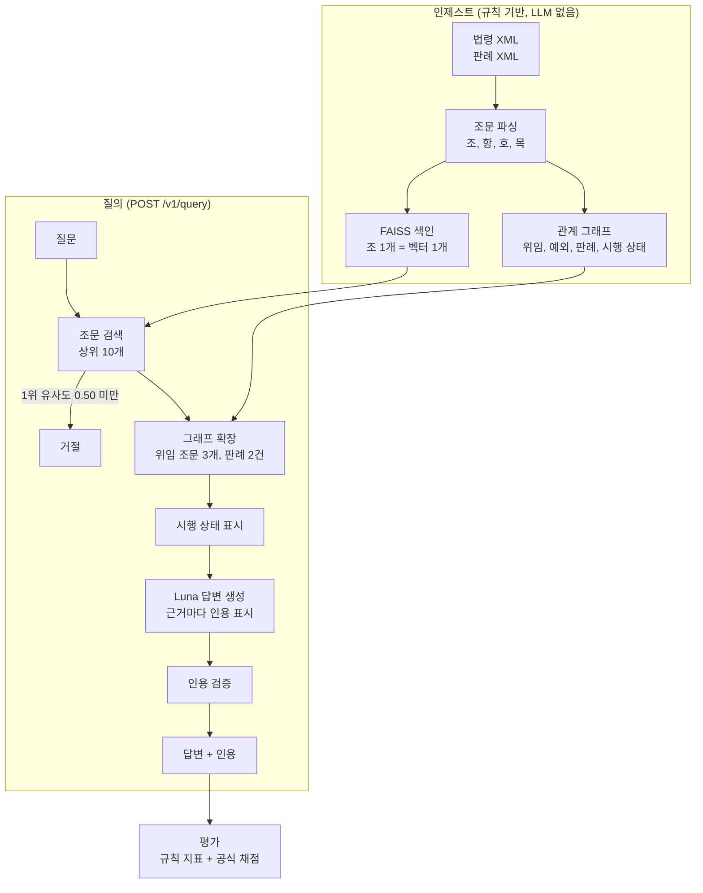

# 노동법령 RAG QA + 자체 Eval Harness

노동 관계 법령 24건과 대법원 판례 400건으로 답하는 RAG 서비스, 그리고 이 서비스의 품질을 재는 평가 체계.

**결과: 전체 정답률 0.470 → 0.633 (+16.3%p, 95% CI +8.7~+24.0%p)**

> 상세 리포트: [Part A](docs/reports/part-a-rag-service.md), [Part B](docs/reports/part-b-eval-harness.md), [Part C](docs/reports/part-c-experiments.md)
> 실측 기록: [docs/findings/](docs/findings/), 실험 사전 등록: [docs/plans/](docs/plans/)

## 용어

이 문서는 아래 용어만 씀.

| 용어 | 뜻 |
|---|---|
| Gold Set | 평가 문항 100개 (`eval/gold/gold_v2.jsonl`) |
| 정답 근거 | 문항마다 정한 정답 조문과 정답 판례 (검색 채점용) |
| 정답 포인트 | 문항마다 정한, 답변에 꼭 있어야 하는 사실 (답변 채점용) |
| 전체 정답률 | 100문항 중 올바르게 처리한 비율 (헤드라인 지표) |
| 공식 채점 | Opus와 Codex가 둘 다 "정답 포인트 포함"으로 판정할 때만 정답으로 셈 |
| 기준선 | 처음 구성: 조를 항 단위로 분할한 색인, KURE-v1, 검색 5개, 판례 없음 |
| 최종 구성 | 조 전체 색인, 판례 연결, Qwen3-Embedding-4B, 검색 10개 |
| 유형 코드 | L1 단일 조문 / L2 조건과 경계값 / L3 다중 조문, 위임, 예외 / L4 시점 / SUM 요약 / L5a 판례 사례(조문으로 결론) / L5b 판례 인용 / OOS 범위 밖 |

## 요약

| 과제의 질문 | 답 |
|---|---|
| 품질을 어떻게 정의하나 | 전체 정답률. 답할 수 있는 문항은 정답 포인트를 모두 담아야 정답. 답할 수 없는 문항은 거절하거나 근거 없음을 밝혀야 정답 |
| 품질을 어떻게 측정하나 | 검색, 거절, 인용은 규칙으로 계산. 정답 포인트는 공식 채점으로 판정 |
| 개선을 어떻게 증명하나 | 같은 설정을 3회 실행. 문항별 평균끼리 paired bootstrap 95% CI로 비교. 가설은 측정 전에 등록 |
| 채점은 믿을 만한가 | 사람이 최종 구성의 정답 포인트 231개를 모두 판정. Codex가 231개 모두 사람과 일치 |
| 비용 | 엘리스 크레딧 약 36,000원. 생성과 평가 약 28,000원, GPU 약 7,300원, 학습 데이터 생성 약 1,000원 |

## 실행 방법

준비: Python 3.12 이상, [uv](https://docs.astral.sh/uv/), 메모리 16GB 이상.

```bash
# 1. 설치
uv sync
cp .env.example .env          # 아래 환경 변수 표의 값을 채움

# 2. Corpus 수집 (원문 스냅샷이 data/raw/에 있으므로 다시 받을 때만)
uv run python scripts/fetch_laws.py
uv run python scripts/fetch_precedents.py bulk --max 400

# 3. 인제스트와 테스트 (처음 실행하면 임베딩 모델을 내려받음)
make ingest
uv run pytest -q

# 4. 서버 실행과 질의 ("stream": true를 넣으면 SSE로 응답)
uv run uvicorn app.api:app --port 8000
curl localhost:8000/v1/query -H 'Content-Type: application/json' \
  -d '{"question": "연차휴가를 시간 단위로 쓸 수 있나요?", "as_of": "2026-10-01"}'

# 5. 평가
make eval NAME=final                                                      # 답변 생성, 규칙 지표, report.md
uv run python -m eval.rejudge final runs/<실행1> runs/<실행2> runs/<실행3> --all   # 공식 채점
uv run python -m eval.multirun '<기준선 실행>' '<실험 실행>'               # 3회 대 3회 비교
```

| 환경 변수 | 용도 |
|---|---|
| `ELICE_API_KEY` | 엘리스 ML API 키 |
| `ELICE_BASE_URL` | `https://mlapi.run/v1` |
| `LLM_MODEL` | `openai/gpt-5.6-luna` |
| `LAW_OC` | 국가법령정보 OPEN API 키 (Corpus를 다시 받을 때만) |

- 공식 채점(로컬): `claude` CLI와 `codex` CLI에 로그인해야 함
- 공식 채점(CI, 설계): 같은 채점 프롬프트를 API로 호출하고 `ANTHROPIC_API_KEY`, `OPENAI_API_KEY`를 CI 시크릿으로 주입함. API 방식은 아직 구현하지 않음
- 공식 채점이 중간에 멈추면 같은 명령을 다시 실행. 저장된 판정은 다시 호출하지 않음
- 실행 결과는 `runs/<시각>_<이름>/`에 저장: 답변, 문항별 점수, report.md, manifest.json(모델, seed, 프롬프트, 임베딩, Gold Set 해시, git sha, 비용)

## 선정 근거

**데이터셋: 노동 관계 법령 24건 + 대법원 판례 400건**
- 범위: 8개 법 × (법률, 시행령, 시행규칙), 조문 894개, 약 255페이지
- 판정이 쉬움: 정답이 수치, 조건, 예외로 정해짐
- 다중 근거 질문이 생김: 법이 세부 기준을 시행령에 위임함
- Hallucination이 보임: 최근 개정 내용은 모델이 문맥 없이 40%만 맞힘
- 재현이 쉬움: 공공 저작물이라 원문 XML을 저장소에 넣음

**모델과 도구**

| 대상 | 선택 | 근거 |
|---|---|---|
| 답변 생성 | GPT-5.6 Luna (엘리스 ML API) | 크레딧 5만원으로 3회 반복 측정이 가능한 단가 |
| 임베딩 | Qwen3-Embedding-4B (로컬 실행) | 엘리스 ML API에 임베딩 모델이 없음. 6개 모델을 비교해 정답 근거를 가장 많이 찾음 |
| 채점 | Opus와 Codex | 생성 모델(Luna)이 자기 답변을 후하게 채점함. 채점자 의견이 갈린 55개에서 Luna는 사람과 0개 일치 |
| 검색 저장소 | FAISS + JSON 관계 그래프 | 조문 894개 규모. 정확 검색이라 같은 질문에 같은 결과 |
| 프레임워크 | 쓰지 않음 | 각 단계를 따로 측정하고 켜고 끄기 위함 |

## 시스템 아키텍처



## Part A: RAG 서비스

필수 6개, 기대 3개 요구사항을 모두 구현함.

| 요구사항 | 구현 | 위치 |
|---|---|---|
| Ingest Pipeline | 법령 XML을 파싱하고 관계 그래프와 색인을 만듦. `make ingest` 한 번으로 실행 | `app/ingest/`, `app/index.py` |
| Chunking 전략 | 조 1개를 청크 1개로 씀 (근거는 아래) | Part A 리포트 |
| Embedding, Index | Qwen3-Embedding-4B, FAISS | `data/index/` |
| 검색, 생성 API | FastAPI `POST /v1/query` | `app/api.py`, `app/rag.py` |
| Citation | 답변의 `[S#]`마다 조문 또는 판례, 인용 문장, 시행 상태, 원문 링크를 붙임 | `app/rag.py` |
| Request/Response Schema | 요청: `question`, `top_k`(기본 10), `as_of`, `stream`, `precedents`<br/>응답: `status`, `answer`, `citations[]`, `retrieval[]`, `meta` | `app/schemas.py` |
| (기대) 답이 없을 때 거절 | 1위 유사도가 0.50 미만이면 거절. 모델이 근거 없음을 쓰면 거절. 유효한 인용이 없으면 거절 | `app/rag.py` |
| (기대) API 키 분리 | 키는 `.env`에만 둠. `.env`는 git에서 제외 | `.env.example` |
| (가산) Streaming | SSE로 `delta` 이벤트를 보내고 마지막에 `final` 이벤트를 보냄 | `app/api.py` |

**Chunking 근거**
- 조를 항 단위로 나누면 단서와 나머지 항이 문맥에서 빠짐 (g021에서 확인)
- 고정 길이 분할은 인용 정밀도를 0.700에서 0.306으로 떨어뜨림
- 대가: 긴 조는 벡터가 여러 주제의 평균이 되어 순위가 내려감 (g016, g030)

## Part B: Eval Harness

### Gold Set

| 유형 | 문항 수 | 정답이 되는 응답 |
|---|---|---|
| L1, L2, L3 | 10, 19, 23 | 답변 |
| L4 | 15 | 답변 + 시행일과 효력 상태 |
| SUM | 8 | 여러 조문을 묶은 요약 |
| L5a, L5b | 8, 9 | 답변 (L5b는 판례임을 밝히고 인용) |
| OOS | 8 | 거절하거나 근거 없음을 밝힘 |

- 문항마다 정답 근거(모두 162개)와 정답 포인트(모두 231개)가 있음
- 만드는 순서:
    1. 스크립트가 조문 구조에서 문항 후보를 뽑음 (시스템 답변은 보지 않음)
    2. AI가 초안을 씀
    3. 스크립트가 정답 포인트 문구가 원문에 있는지 검사함
    4. 다른 모델이 초안을 다시 검토함
    5. 사람이 문항마다 원문과 대조해 확정함
    6. 실행 결과로 Gold Set을 다시 점검함 (결함 3건을 사람이 삭제)
- 단계별 도구와 기록 파일: [Part B §3.5](docs/reports/part-b-eval-harness.md)
- dev 44문항, test 56문항으로 나눔. 설정값은 dev만 보고 정함
- 편향과 한계:
    - 초안은 한 계열의 AI가 씀
    - 사람 확인은 1명이 했고, AI 초안과 검토 결과를 보며 판정함
    - 실험할 유형을 일부러 늘려서 실제 질문 분포와 다름

### 지표

| 지표 | 무엇을 재나 | 기준선 → 최종 구성 |
|---|---|---|
| **M0 전체 정답률** (공식 채점) | 100문항 중 올바르게 처리한 비율 | **0.470 → 0.633** |
| M1 검색 | 정답 근거를 1개 이상 찾음 / 모두 찾음 / MRR | 0.924 / 0.696 / 0.799 → 0.989 / 0.848 / 0.875 |
| M2 거절 | OOS 거절률 / 답할 수 있는데 거절한 비율 | 1.000 / 0.105 → 1.000 / 0.000 |
| M3 인용 | 정답 근거를 인용한 비율 / 인용 중 정답 근거 비율 | 0.762 / 0.700 → 0.917 / 0.558 |
| M5, M6 (참고) | 근거 없는 주장 / 시점 오류 | 0.019 / 0.024 → 0.043 / 0.067 |

- 모든 수치는 같은 설정 3회의 평균
- 거절은 재현율 지표에서 0점으로 셈. 어려운 문항을 거절해 점수를 올리는 것을 막기 위함
- 정밀도 지표는 답변한 문항만 셈
- 맹점:
    - M0는 가장 엄격한 채점자(Codex)의 판정에 가까워짐
    - M1은 판례를 검색이 아닌 그래프 연결로 찾으므로 판례를 세지 못함
    - M3 정밀도는 정답 근거 목록 밖의 보조 조문도 오류로 셈
    - M5, M6는 아직 Luna가 채점함

### 채점 신뢰성

사람이 최종 구성 답변의 정답 포인트 231개를 모두 판정함.

| 채점자 | 사람과 일치 |
|---|---|
| **Codex** | **231 / 231** |
| Opus | 204 / 231 |
| Luna (답변 생성 모델) | 176 / 231. 채점자 의견이 갈린 55개에서는 0개 일치 → 채점에서 제외 |

- 채점자는 질문, 정답 포인트, 답변만 봄. 다른 채점자의 판정은 보지 않음
- 한계: 사람 판정은 1명이 했고, 채점자의 판정을 보며 판정함. 기준선 답변은 사람이 판정하지 않음

### 자동화, 재현성, CI

- 단일 명령: `make eval`이 100문항을 실행하고 지표와 report를 만듦
- 재현성: seed 42, temperature 0, LLM 응답 캐시, 실행마다 manifest 저장, 실행마다 예산 상한
- CI 설계:
    1. PR마다 0원 검사: 테스트, Gold Set 검사, 검색 지표
    2. 라벨이 붙은 PR과 야간에 3회 평가
    3. 공식 채점. API 키는 CI 시크릿으로 주입
    4. 노이즈 폭과 95% CI를 모두 넘는 하락만 실패로 처리
    5. 채점자를 바꾸면 사람 판정 231개로 먼저 검증
- 비용 상한: 생성은 `--budget`, 채점은 `--max-calls` (구현됨). 월간 상한과 비용 증가 감시는 설계만 함
- 상세: [Part B §11](docs/reports/part-b-eval-harness.md)

## Part C: 개선 실험

4개 변경을 채택함. 여러 시도는 효과가 없음을 확인함. 평가 체계의 결함 3건을 찾아 고침.

### 실험 결과

| 실험 | 결과 (3회 평균) | 판정 |
|---|---|---|
| 조 전체 색인 | 분할된 조를 묻는 질문의 순위가 오름. 검색 성능은 같음 | 채택 |
| **판례 연결** | L5b 완전 정답 0 → 0.444 (CI +0.11~+0.78) | **채택** |
| **임베딩 교체** (KURE → Qwen3-4B) | 정답 근거를 모두 찾은 비율 0.696 → 0.772 | **채택** |
| **검색 5 → 10** | 전체 정답률(Luna 채점) 0.847 → 0.930 (CI +3.7~+13.7%p) | **채택** |
| 시행 상태 표시 끄기 | L4 완전 정답 0.667 → 0.240 | 예측대로 하락 (설계 검증) |
| 임베딩 파인튜닝 | 학습 시드에 따른 흔들림보다 작음. 상승분은 Gold Set 정답 근거가 학습에 섞인 결과 | 효과 없음 |
| 일반화 개선 7종 | 유의한 개선 0개. 재정렬과 질문 재작성은 유의하게 하락 | 효과 없음 |
| 시점 답변 규칙 | L4 6.3 → 11.0문항 (CI +6.7~+55.6%p). 전체는 변화 없음 | L4만 개선 |

- 각 실험의 상세: [Part C](docs/reports/part-c-experiments.md)

### 대표 실험: 판례 연결

**Hypothesis**
- 조문만으로 결론이 나지 않는 질문(L5b)에서 시스템은 "판단할 수 없음"으로 끝남
- 검색한 조문에 연결된 판례를 넣고 판례임을 밝혀 인용하게 하면 L5b 완전 정답이 오름
- 예상 부작용: 인용 정밀도가 내려가고 입력 토큰이 늘어남

**Result**

| 지표 | 기준선 | 판례 연결 | 95% CI | 판정 |
|---|---|---|---|---|
| L5b 완전 정답 (9문항) | 0.000 | **0.444** | +0.111 ~ +0.778 | 개선 |
| 답할 수 있는데 거절한 비율 | 0.105 | 0.065 | - | 개선 |
| 인용 정밀도 | 0.700 | 0.609 | 유의 | 하락 (예상대로) |
| 입력 토큰/호출 | 3,576 | 5,581 | - | +56% |

**Analysis**
- 해결한 4문항은 "조문 → 대법원 판단 → 사안에 따라 다를 수 있음" 순서로 답함
- 해결하지 못한 5문항은 실패 단계가 모두 다름: 판례 연결 범위 1, 거절 기준 1, 검색 2, 답변 생성 1
- 인용 정밀도 하락은 틀린 근거가 아니라 보조 근거(판례, 관련 조문)가 늘어난 결과

**Next Steps**
- 판례 관련도를 재정렬로 다시 고름
- 판례를 직접 검색하는 보조 경로를 추가함
- 이후 검색 10과 임베딩 교체로 l5b03, l5b05, l5b08을 해결함

### 평가 체계에서 찾아 고친 결함

| 결함 | 증상 | 수정 |
|---|---|---|
| 기준선을 1회만 실행 | 흔들리는 문항이 우연히 "개선"처럼 보임 | 기준선을 3회 평균으로 바꿈 |
| 채점자가 너무 후함 | Luna가 조건을 빠뜨린 답변도 정답으로 셈 | 공식 채점으로 바꾸고 사람 판정 231개로 검증 |
| Gold Set이 질문 범위를 넘음 | 질문이 묻지 않은 사실을 정답 포인트로 요구 (3건) | 사람이 3건을 삭제하고 판정이 바뀌지 않음을 확인 |

### Next Steps

공식 채점의 오답 110건 중 86건(78%)은 정답 근거를 받고도 답변에서 틀림. 그래서 답변 생성 개선을 먼저 함.

1. 시점 답변 규칙을 시점을 묻는 질문에만 적용해 다른 유형의 하락을 막음
2. 질문과 관련이 낮은 근거 블록과 불필요한 판례를 뺌
3. 판례 색인을 Qwen3로 바꾸고 전원합의체와 최신 판례를 우선함 (L5b는 정답 근거를 9문항 중 3문항에서만 모두 찾음)
4. 실패가 많은 유형의 문항을 늘림 (지금 표본으로는 +1~3%p 효과를 노이즈와 구별할 수 없음)

## 설계 결정과 Trade-off

| 결정 | 선택 | 대가 |
|---|---|---|
| 청크 단위 | 조 1개 = 청크 1개 | 긴 조는 순위가 내려감. 입력 토큰이 늘어남 |
| 시행 상태 | 인제스트 때 규칙으로 계산해 블록에 표시. 날짜 판단을 LLM에 맡기지 않음 | 시행예정 버전과 부칙 파싱 규칙을 유지해야 함 |
| 판례 연결 | 검색한 조문에 연결된 판례만 씀 | 연결 조문을 못 찾으면 판례에 닿지 못함 (l5b06) |
| 임베딩 | Qwen3-Embedding-4B | 맥에서 질의마다 약 3초, 모델 약 8GB. 서비스에는 GPU 추론 서버가 필요 |
| 검색 개수 | 10개 | 입력 토큰 +23%, 응답 지연 3.7초 → 4.8초 |
| 채점 | Opus와 Codex (로컬 CLI 구독) | 크레딧은 들지 않음. 대신 느리고(276건에 약 45분) 구독 한도가 있음 |

## 한계, 알려진 이슈, 향후 과제

| 영역 | 한계 | 향후 과제 |
|---|---|---|
| 답변 생성 | 정답 근거를 받고도 조건과 시행일을 빠뜨림 (오답의 78%) | 질문 유형별 답변 규칙, 근거 블록 정리 |
| 검색과 판례 | 구어체 사례 질문을 놓침 (l5b06은 정답 조문이 29위)<br/>판례 색인은 아직 KURE<br/>전원합의체 대신 후속 판례를 고름 (l5b01) | 판례 색인 교체, 판례 위계 반영 |
| 관계 그래프 | 다른 법을 가리키는 예외와 일부 위임을 연결하지 못함 (n05, n29) | 「법령명」 인용 파싱 |
| 평가 | 전체 정답률이 채점자에 따라 크게 다름 (Luna 0.930, 공식 0.633)<br/>사람 판정은 1명, 비블라인드<br/>M5, M6는 Luna 채점 | 블라인드 다중 판정, M5와 M6 채점자 교체 |
| Gold Set | 한 계열 AI가 작성<br/>문어체 질문이 많음<br/>L4, L5b 표본이 작음 (15, 9) | 실제 사용자 질문 수집, 실패 유형 문항 추가 |
| 운영 | 질의 임베딩이 느림<br/>공식 채점의 API 방식은 구현하지 않음 (CLI만 있음) | GPU 추론 서버, API 채점과 채점자 회귀 검사 |
